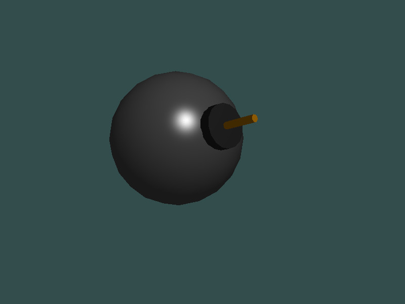

### Combine Mesh

You can combine several meshes. Each submesh can have it's own material.

Create meshes on the fly and combine them:
[!code-cs[Main](Program.cs#construct)]

Assign materials:
[!code-cs[Main](Program.cs#materials)]

Complete sample:
[!code-cs[Main](Program.cs)]

### Screenshot

