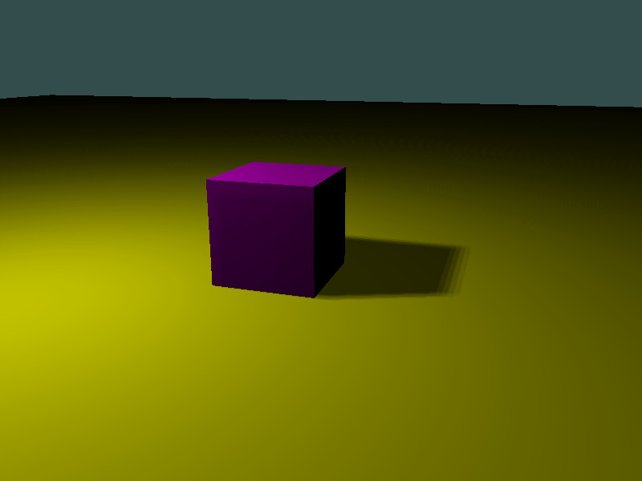

### Shadows

Shadows are possible with PointLights and DirectionalLights.

Just set the CastShadows property to true:
[!code-cs[Main](Program.cs#shadows)]

Complete sample:
[!code-cs[Main](Program.cs)]

### Screenshot

